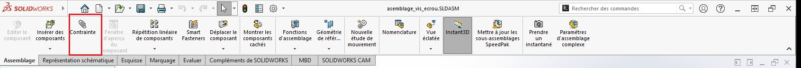
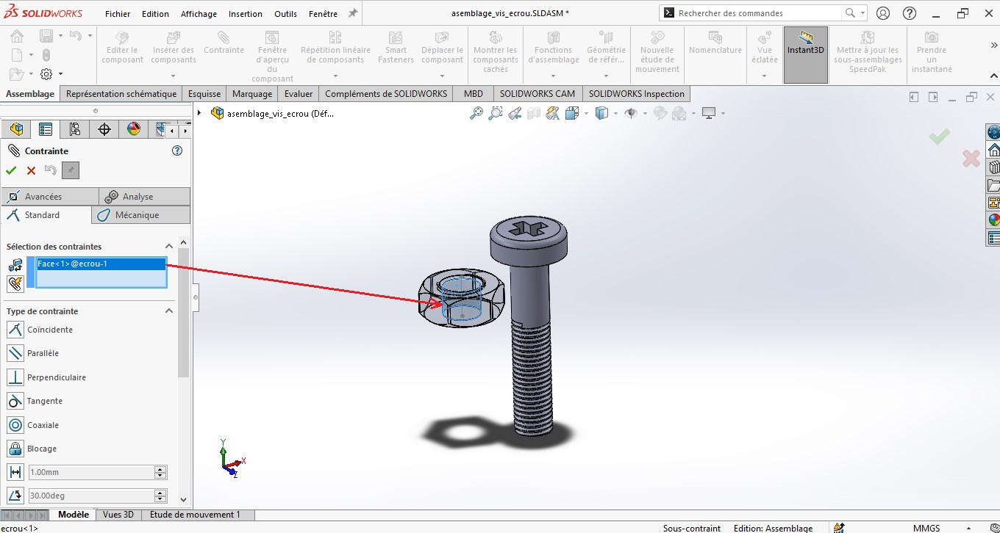

$$version 1.1$$
Dans cette deuxième section on va commencer à assembler des petits systèmes en créant des contraintes entre les faces(frontières) de nos pièces afin de les bien assembler.

# Sommaire

## II. Contraindre des pièces

#### 1. Introduction aux contraintes

Une contrainte nous sert à lier deux pièces. nous l'avions déjà vu sur la partie création d'esquisse. Cependant, pour les assemblages, leur nombre est plus important.

Reprenons notre exemple de vis-écrou, après importation bien sur, pour contraindre ces deux pièces, cliquer sur le bouton de la fonction __Contrainte__.

Maintenant il faut sélectionner le cylindre intérieur de l'écrou comme la figure.

Après il faudra encore sélectionner cette fois-ci la partie extérieure de notre vis, vous allez voir que SolidWorks a automatiquement détecter la contrainte de type *coaxiale* entre les deux parties des de nos deux pièces, comme la figure suivante.

Il ne vous reste que de valider la fonction. La contrainte est visible sur l'arbre de création.

Vous puvez constaté que mon écrou est libre en rotation et en translation suivant la hauteur de la vis (axe y), mais vous ne pouvez pas le faire bouger.

On va rajouter une deuxième contrainte, cette fois-ci de distance pour que mon écrou ne bouge plus suivant l'axe y.
Je recommence les opérations précédentes, je sélectionne la face basse de la tête de ma vis et la face haute de mon écrou, SolidWorks me proposera une contrainte de *coïncidence*, mais on va cliquer sur le bouton de la contrainte *distance* entourée en rouge et on valide (figure suivante).

Maintenant vous pouvez constaté que l'écrou ne bouge pas sur la hauteur, il peut seulement tourner . Pour le contraindre totalement on va rajouter une troisième contrainte. 
D'abord on recommence les mêmes opérations, cette fois-ci on sélectionne la face droite ainsi que l'une des six face extérieures de notre écrou, SolidWorks va vous proposer une contrainte parallèle entre ces deux faces.

Maintenant nos deux pièces sont totalement contraintes.

$$version 1.2$$

#### 2. Liste des contraintes utilisées

Bien que nous avions utiliser les contraintes (coaxiale, distance, parallèle), Il existe sur SolidWorks bien d'autres contraintes que les trois que nous venons de voir. Nous pourrions les regrouper sous trois grandes catégories : 

#### a. Contraintes standard

Nous allons voir dans cette première partie d'autres contraintes les plus utilisées sur SolidWorks.

##### 1. Coïncidence

C'est quand on veut  coller deux points, deux segemnts ou deux surfaces,  l'une contre l'autre. C'est la première contrainte peut-être la plus utilisée, Après avoir importer mes deux pièces dans mon projet d'assemblage que vous pouvez trouvez dans le repertoire Projet\tutoriels_CAD-CAM-FEA-didacticiel\assemblages\contraintes.

Sélectionner en maintenant la touche ctrl de votre clavier les deux surfaces planes de la partie haute de notre joints qu'on veut contraindre, puis cliquer selon votre choix sur la fonction __Contrainte__ et choisir la contrainte _Coincidence_.

La validation de votre contrainte vous permet autant de fois que vous le vouliez appliquer des contraintes, la fonction reste toujours active, passons maintenant à la même manipulation cette fois-ci des deux faces de la partie basse, 

__Note__ : La pièce n'est pas totalment contrainte car elle peut encore bouger suivant l'axe z.

Il est important que vous fixer vous même la façon de contraindre vos pièces, j'ai pu faire autrement, de sélectionner une seule face, 

 

##### 2. Coaxiale

Reprenons notre exemple d'assemblage précédent, dans le cas où je vais rajouter une contrainte de coaxialité, 

##### 3. Perpendiculaire

C'est contraintes qui est très peu utilisée, mais il faudra l'introduire pour comprendre son utilité, elle est appliqué e sur deux segments ou faces qui sont perpendiculaires, il faudra penser à faire une ligne de contruction pour chaque pièce.

##### 4. Tangente

Avec le même exemple, on l'utilise souvent entre une face cylindrique et une face  plane, parmi les exemple on pourra créer une contrainte entre un joints et une face d'une pièce d'une pompe, 

 

##### 5. Bloquante

Les deux entités sélectionnés seront bloqués entre eux, mais leurs mouvements seront liés, si on fait bouger une l'autre bouge aussi.

##### 6. Distance

Nous avions vu en haut cette contrainte, on va la refaire pour créer une contrainte entre une goupille et le palier d'une pompe, la contrainte distance me servira à mettre à mi-distance la goupille avec le cercle du persage de mon palier. 

##### 7. Angle

Cette contrainte permet de spécifier un angle entre deux entités sélectionnées.

#### b. Contraintes avancées

##### 1. Symétrie

La contrainte de symétrie permet à deux entités de se comporter de façon symétrique par rapport à un plan.

###### 2. Glissière

Une contrainte  glissière permet à un objet de glisser suivant une seule direction, les deux autres sont bloquées. Donc elle bouge avec une distance égale.

#### c. Contraintes mécaniques

Les contraintes mécaniques sont vraiment spécifiques aux études des macanismes. 

Nous pourrions avoir : 

- Pivot; 
- Came; 
- Pignon-crémaillère; 
- engrenage droit; 
- engrenage hélicoïdale; 
- Cardan.
