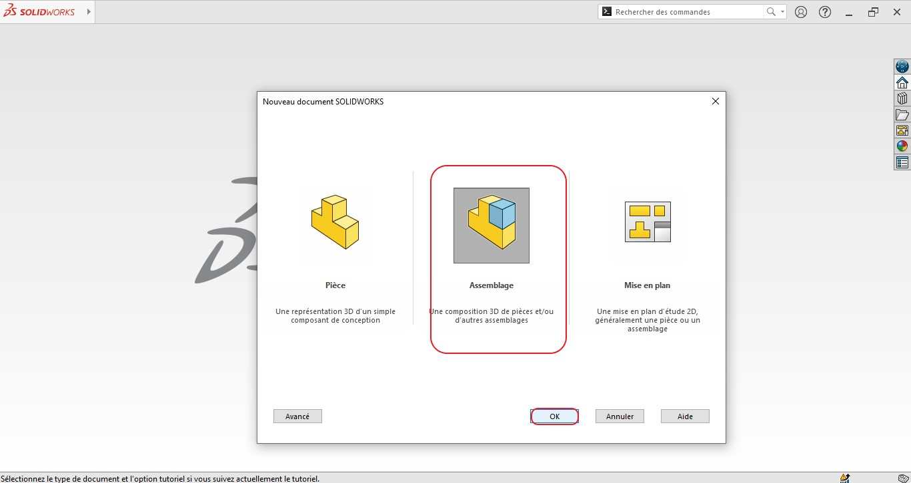
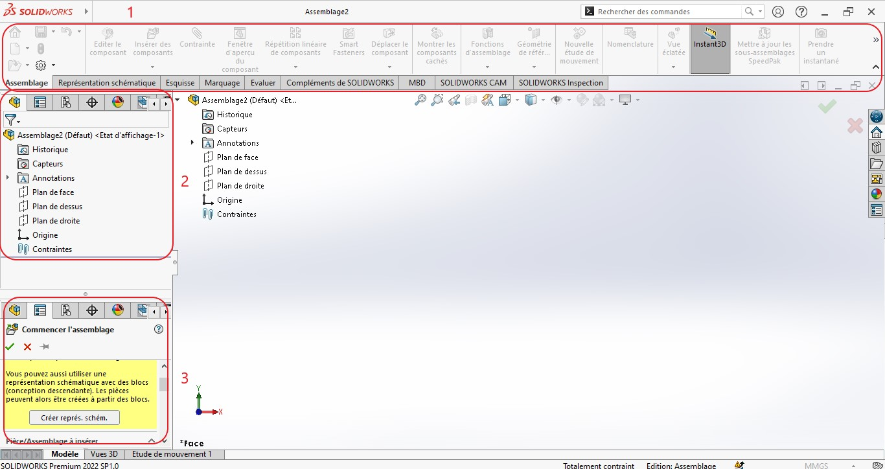
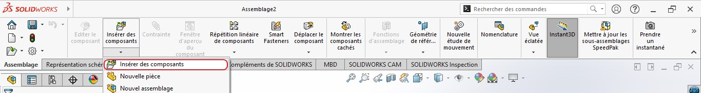
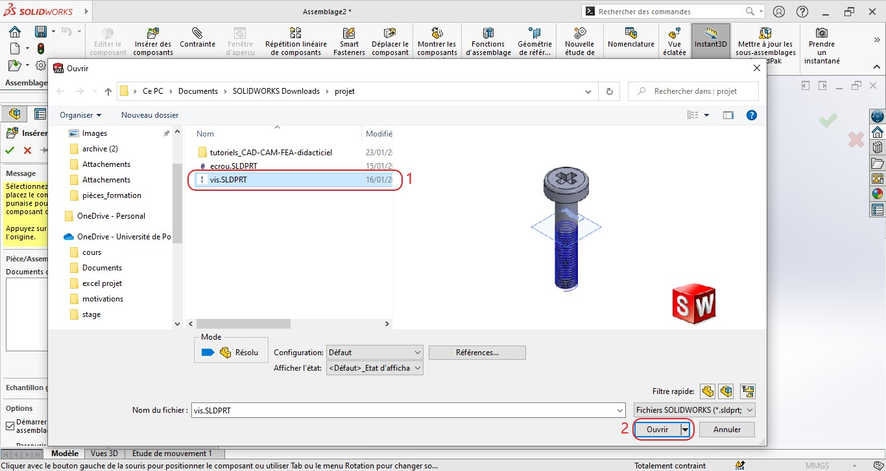
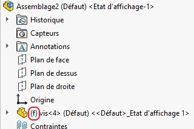
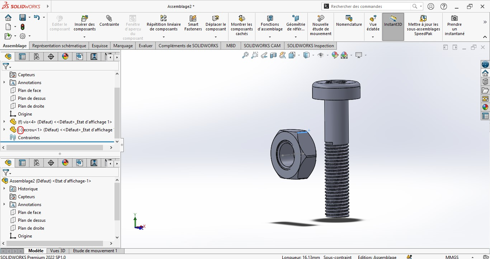
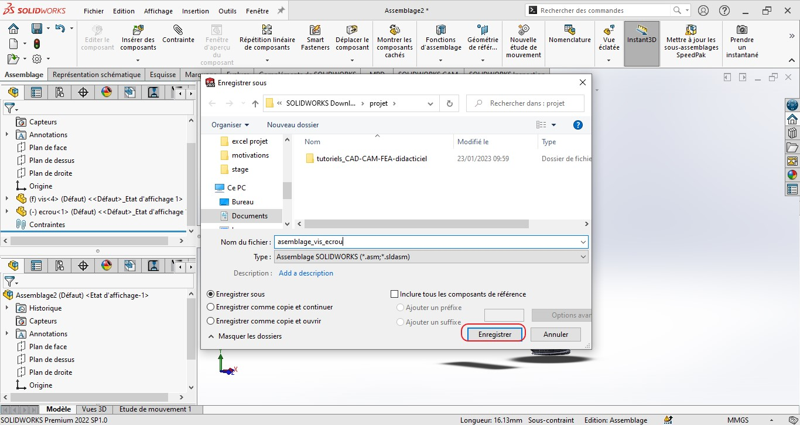

$$version 1.0$$

Cette première section est une brève introduction au projet d'assemblage sur SolidWorks, elle contient un premier contact avec l'interface déjà connue, mais un plus spécifique. 

# Sommaire :

## I. Création et importation

#### a. Création

Pour créer un nouvel assemblage sur SolidWorks rien de plus simple, sur la page de démarrage, on clique sur le menu Fichier, puis sur le bouton nouveau.

ça va nous faire sortir la première boite de dialogue que nous avions déjà comment l'utilisé, cette fois-ci on clique sur le bouton assembalge.

et Vous aurez cette nouvelle interface dédiée à l'assemblage, elle est la même que celle de la partie conception, mais elle importe cette fois-ci les outils nécessaires pour les assemblages que nous réaliserons plus tard.

1. Le bandeau des outils principaux; 
2. L'arbre des pièces qui seront importées, ainsi que les contraintes d'assemblages;
3. Menu des options, boite d'importation.

#### b. Importation

Pour importer des pièces il vous suffit de cliquer sur le bouton de la fonction "Insérer des composants".

une boite de dialogue s'ouvre et vous pouvez sélectionner pièce par pièce ou directement toutes pièces que vous voulez d'un seul coup, même si je ne recommande pas cette dernière.
Commençons par importer la première pièce qui est la vis. 

Une fois l'opération d'importation validée, SolidWorks vous donnera la possibilité de faire translater la pièce dans n'importe quelle position sur la fenêtre de travail, vous choisissez cette position et elle sera ensuite fixée et vous ne pourriez plus la déplacée. Pour savoir si votre pièce est fixée un signe (f) va précéder le nom de la pièce comme dans la figure suivante.

Vous pouvez répéter l'opération pour importer l'écrou, cette fois-ci la pièce est libre car le son nom est précédé par (-).

#### c. Enregister l'assemblge

Il faudra penser à enregistrer nos assemblages en fur et à mesure qu'on avancera dans nos projet, pour cela il faut tout cliquer sur le bouton "enregistrer " su menu Fichier. puis donner un nom à notre fichier d'assemblage.

Les fichiers d'assemblage sous SolidWorks ont l'extension **".sldasm"**.

#### d. Fonctions de bases sur les assemblages

###### 1- Origine pièce/environnement

L'une des notion les plus importante dans l'importation des pièces pour les assemblages et l'origine de la pièce et l'orgine de l'envoronement SolidWorks, il faut toujours les faire coincider.

Nous avions appris à importer les pièces, mais au moment de l'import il faut s'assurer de la coincidence des origines pièce/environnement, car ça va nous faciliter la tâche dans le future.

Si je reviens à mon exemple, 

###### 2- Menu contextuel

Quand on clique sur le bouton droit de la souris, on aura un menu avec lequel il nous y est possible de faire beaucoup de choses : 

- Fixer / bouger une pièce ; 

###### 3- Assemblage sur place

Il existe un moyen de faire un assemblage sur place, cela veut dire qu'on peut se servir des fonctionnalités de conception dans un projet d'assemblage dans SolidWorks pour créer une pièce qui ne sera pas référencer de l'extérieur de projet comme on vient de le faire en haut.

Ces pièces ne seront visible que dans le projet d'assemblage.

###### 4- Créer un sous-assemblage

Il est possible de créer autant de sous-assemblages qu'on veut sur SolidWorks, 

###### 5- Enregistrer les composants dans des fichiers externes

Il existe un moyen qui nous permettra comme même de sauver les composants qu'on peut créer dans un projet d'assemblage dans des fichiers externes.
