$$version 1.0$$

La troisième partie est une introduction aux fonctionnalités de bases de la conception  volumique de SolidWorks. Dans un premier temps nous allons voir les fonctions d'ajout de la matière à partir des esquisses, dans un second lieu on verra  l'intérêt des fonctions  d'enlèvement de la matière pour enlever de la matière ou de les trouées pour obtenir nos futures pièces.

version PDF : [[🗂️Conception volumique.pdf]]

# Sommaire

## I. Ajout de la matière

 Nous avions vu dans la deuxième partie comment construire une esquisse avec toutes les fonctionnalités dédiés pour ça, la boite à outil de SolidWorks est très large pour une meilleur productivité.

Cette partie est consacré à l'ajout de volume à partir des esquisses que nous voulons construire.

### 1. Bossage/base extrudée

Cette première fonction est la presque la plus utilisée par les  ingénieurs et techniciens  pour ajouter du volume (passage d'un plan en 2D à un volume en 3D).

Dans mon cas je vais utiliser la deuxième méthode, il faudra seulement cliquer sur l'onglet 'Fonctions' puis sur le bouton "Bossage/base extrudé". 
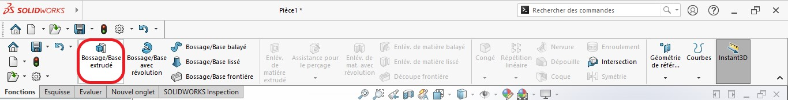

Il faudra ensuite sélectionner l'esquisse qu'on veut extrudé, tout simplement vous dérouler l'arbre de conception en cliquant sur la petite flèche comme sur la figure suivante.

Sur la boite des propriété de la fonction extrudé il existe pas mal de paramètres : 

1. Pour changer la direction de remplissage; 
2. pour définir l'épaisseur de bossage.
3. Type d'extrusion : 
- Borgne : par hauteur (épaisseur), c'est le type par défaut.
- Jusqu'au sommet;
- Jusqu'à la surface;
- Par le milieu; 

Dans mon cas j'ai sélectionné "Borgne", car je voulais introduire une épaisseur de 10mm.

Remarque : Vous pourriez procéder directement en mode Edition d'esquisse ou après validation de l'esquisse.

### 2.Bossage/base avec révolution

Pour par exemple créer une pièce cylindrique il faudra faire une révolution autour d'un axe.
Dans SolidWorks il existe une fonction spéciale nommée "Bossage/base avec révolution".

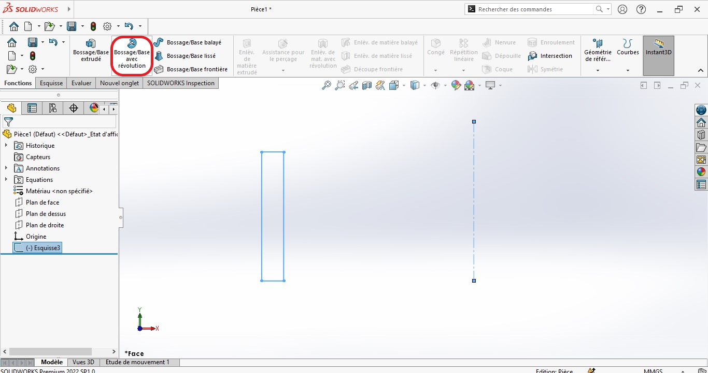

Après avoir créer notre esquisse qui est un rectangle et une ligne de construction qui nous servira pour l'axe de révolution.
SolidWorks détecte automatiquement les deux paramètres et construit notre volume.

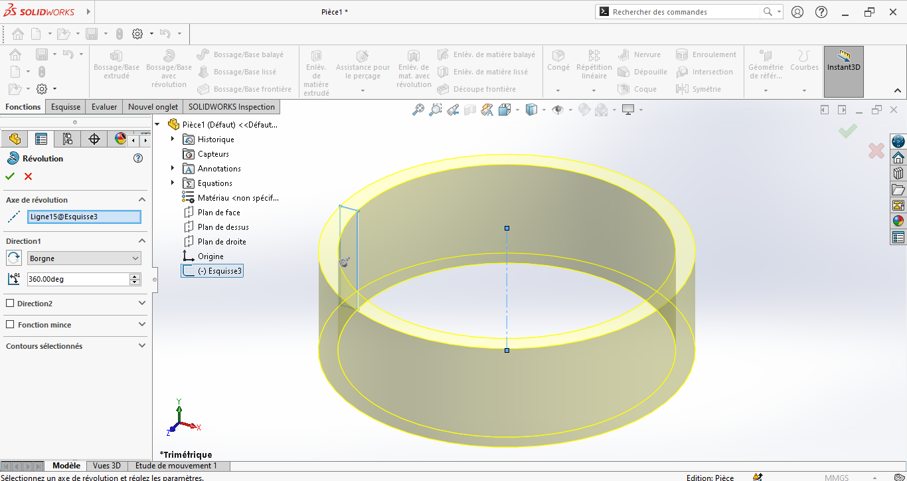

Vous pouvez le constater,  nous avons les mêmes paramètres de la première fonction d'extrusion, y a seulement l'angle de la révolution (360° tour complet) qui est rajouté comme paramètre.

### 3.Bossage/base balayé

Cette fonction a besoin d'un profil de base (esquisse) et d'une deuxième esquisse sous forme d'une courbe qui nous servira à guider à fin de former le premier profil.

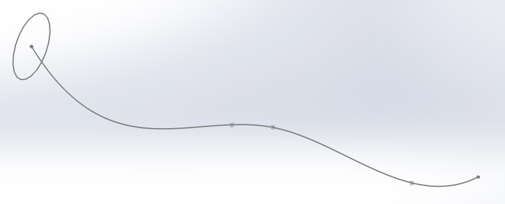

Cliquons maintenant sur le bouton de la fonction "Bossage/base balayé".

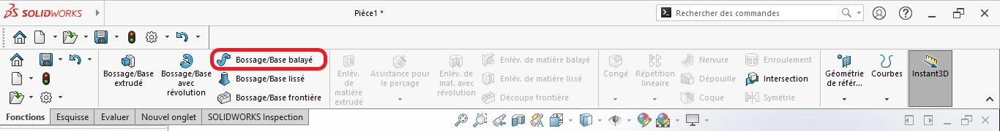

Il faudra spécifié comme on l'avait vu en haut :

1. profil de la forme; 
2. la courbe de trajectoire.

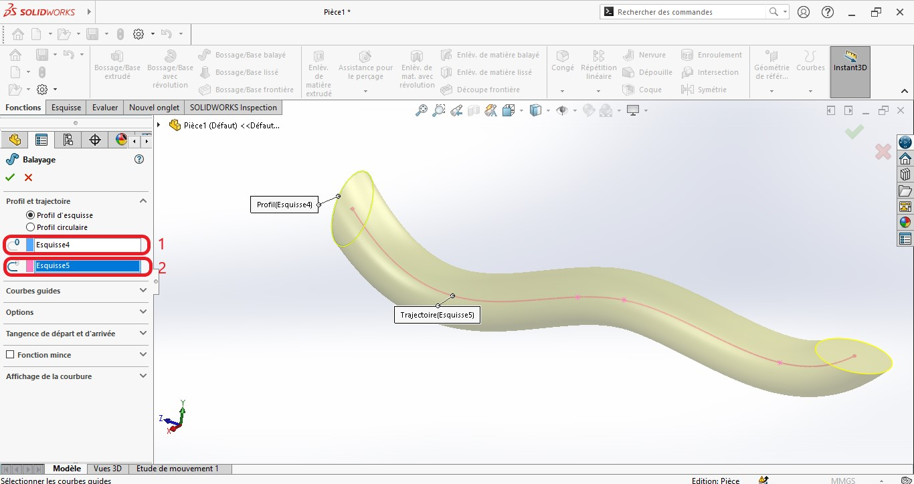

Vous pouvez voir le rendu de la fonction balayé sur la figure de dessous.

### 4.Bossage/base lissé

Cette fonction crée un volume à partir de deux esquisses ou plus. Dans mon exemple j'ai crée deux  plans parallèles à celui du plan de face. Sur le plan de face j'ai esquissé un cercle, sur le deuxième plan un rectangle et sur le troisième un cercle plus grand.

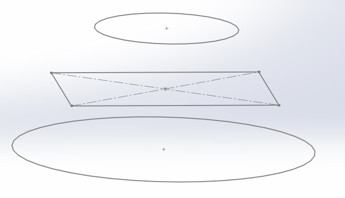

Si je clique maintenant sur la fonction "Bossage/base lissé" comme la figure suivante.

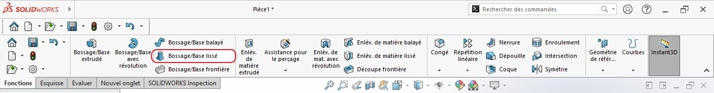

J'aurai les propriétés de cette fonction comme suite : 

1. Nos trois profils; 
2. la courbe de guidage dans laquelle vous pouvez changer la position des points de couleur verte.

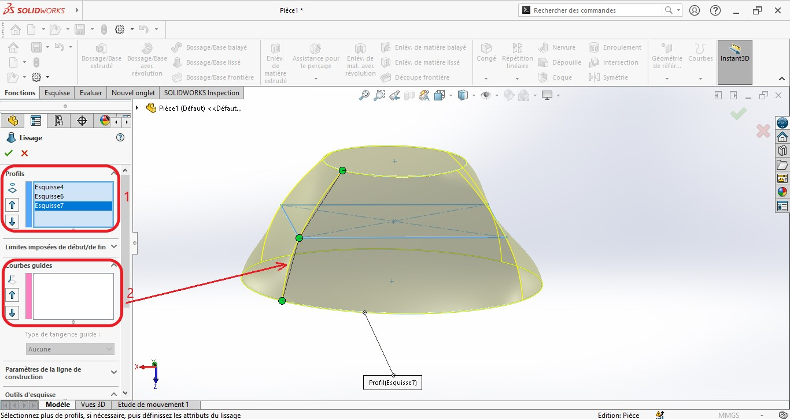

### 5.Bossage/base frontière

On procède de la même manière que la fonction "Bossage/base lissé". Il nous faudra au minimum deux entités à partir desquelles on pourra appliquer former notre volume.

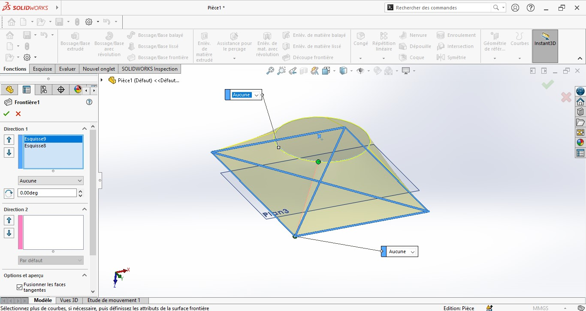

Le résultat de cette fonction est identique à celle de "Bossage/base lissé".

## II. Par enlèvement de la matière

Cette partie sera consacré à l'enlèvement de la matière, contrairement à la première partie qui est d'ajouter de la matière en utilisant des fonction qui nous crée du volume, cette fois-ci à partir des esquisses on demandera de nous enlever de la matière.
En grande partie nous allons revoir les fonctionnalités : 

- Extrusion; 
- Révolution; 
- Balayage; 
- Lissage.

### 1. Enlèvement de la matière extrudée

 Commençons par cette première fonction qui est d'enlevé de la matière, il nous faudra un esquisse dans lequel on créera notre profil à enlever, dans mon cas je vais essayé de troué ma pièce déjà construite avec un "Bossage/base extrudé".

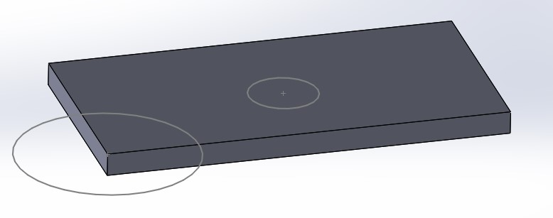

Ensuite il suffit de cliquer sur le fonction "Enlèvement de matière extrudé" comme dans la figure suivante.

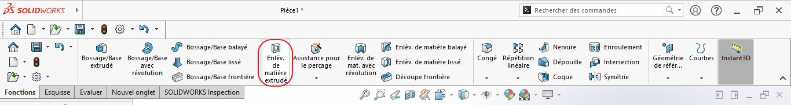

Il faudra choisir l'esquisse duquel on veut enlever de la matière par extrusion, pour cela on défile l'arbre de conception en cliquant sur la petite flèche, on peut remarqué que les fonctions d'enlèvement de la matière ont presque les mêmes propriétés que ceux d'ajout de la matière, je choisi la propriété "Borgne" pour une épaisseur de 10mm.

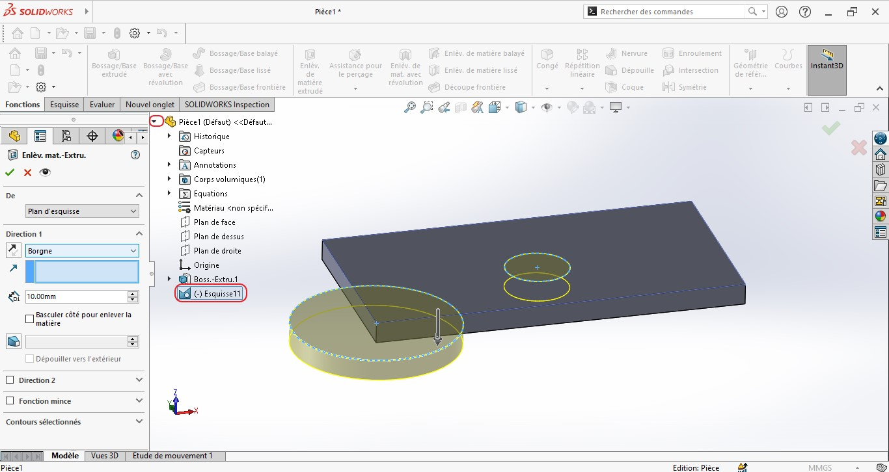

### 2. Enlèvement de la matière avec révolution

Nous commençons par créer notre esquisse dans lequel on va le faire tourné autour un axe.
Remarque : Cet axe doit être colinéaire avec notre profil sinon ça ne marchera pas.

[enlevement_revolution_esquisse.jpg](../Attachements/)

Maintenant on clique sur le fonction "Enlèvement de la matière par révolution" après avoir sélectionné l'esquisse.

[outil_enlevement_revolution.jpg](../Attachements/)

Vous aurez le résultat suivant dans le cas ou vous choisissez l'axe de révolution de celui en bas de la pièce (axe z) comme indiqué sur la figure suivante.

[enlevement_revolution_axe1.jpg](../Attachements/)

Le profil de révolution va changé dans le cas où je vais sélectionné un autre axe comme la figure.

[enlevement_revolution_axe2.jpg](../Attachements/)

### 3. Enlèvement de la matière balayé

On va reproduire la fonction "Balayage" comme dans la première partie, dans un premier temps il nous faut une esquisse : 

- cercle; 
- courbe de trajectoire.

[enlevement_balaye_esquisse.jpg](../Attachements/)

On clique sur le bouton de la fonction "Enlèvement de la matière balayé".

[outil_balaye.jpg](../Attachements/)

Le panneau de la propriété de la fonction s'ouvre à gauche, il faudra spécifier les deux paramètres (cercle et courbe de pilotage) comme la figure suivante.

[enlevement_balaye.jpg](../Attachements/)

Pour voir le résultat de la figure du haut il faut faire une coupe avec l'outil de coupe (entouré en rouge).

[enlevement_balaye_coupe.jpg](../Attachements/)

Cette fonction de coupe vous demandera un plan à partir duquel elle nous générera une coupe, dans mon j'ai sélectionné le plan de face (figure ci-dessus).

### 4. Enlèvement de la matière lissé

Passons à cet outil, maintenant qu'on est habitué avec toutes ces fonctions d'enlèvement, il nous faut toujours au minimum deux esquisses pour faire un lissage tout comme pour celle de l'extrusion. J'ai crée deux plans parallèles à la face du haut de mon cylindre dans lequel j'ai esquissé un cercle, un rectangle et un pentagone.

[enlevement_lisse_esquisse.jpg](../Attachements/)

Je clique sur le bouton de la fonction "Enlèvement de la matière lissé".

[outil_enlevement_lisse.jpg](../Attachements/)

Je spécifie à la fonction mes trois esquisse comme sur la figure suivante.

[enlevement_lisse.jpg](../Attachements/)

SolidWorks va automatiquement généré une géométrie à partir de nos trois esquisses, les trois points en couleur verts servent à piloter la forme générée.

$$version 1.1$$

### 5. Découpe frontière

La différence entre le lissage et la découpe frontière est que la dernière se construit sur plusieurs directions et plusieurs chemins directeurs, sinon dans l'utilisation de base les deux fonctions ont le même résultat.

On clique sur le bouton de notre fonction.

[outil_decoupe_frontiere.jpg](../Attachements/)

On sélectionne les entités, dans mon cas j'ai commencé par orienté la vue de face en normal et j'ai fait glisser les points de chaque diamètre jusqu'à leur extrémité (les points en couleur verte).

[decoupe_frontiere.jpg](../Attachements/)

$$Prévu pour la version 1.1$$

## III . Outils de conceptions

### 1. Congé et Chanfrein

Commençons par le congé, il faudra cliquer sur le bouton de la fonction "Congé".

[outil_conge_fonction.jpg](../Attachements/)

Maintenant vous pouvez sélectionner un à un, les lignes qu'on veut transformer en congé, ou vous maintenez le bouton ctrl du clavier tout en cliquant sur une ligne, une petite boite de dialogue apparait, cliquez ensuite sur le premier bouton ( sélection en boucle).

[conge_fonction_boucle.jpg](../Attachements/)

Vous pouvez dimensionner le diamètre du congé, moi je l'ai mis à 5mm. Il nous reste de valider la fonction pour voir le résultat. 

[conge_validation.jpg](../Attachements/)

De la même manière on peut créer des chanfrein.

[chanfrein_fonction.jpg](../Attachements/)

### 2. Nervure

Nous commençons par esquissé une ligne que nous nous servions pour créer une nervure.

[nervure_esquisse.jpg](../Attachements/)

Cliquons maintenant sur le bouton de la fonction "Nervure".

[outil_nervure.jpg](../Attachements/)

Vous pouvez paramétrer l'épaisseur de la nervure à 10mm.

[nervure.jpg](../Attachements/)

### 3. Dépouille

Une dépouille est une légère inclinaison entre deux faces orthogonaux. Pour créer une dépouille il faut tout simplement cliquer sur le bouton de la fonction "Dépouille".

Mon esquisse de base est un cube.

[outil_depouille.jpg](../Attachements/)

La face qui nous servira de dircetion ne doit pas être parallèle à nos faces de dépouille. 

[depouille.jpg](../Attachements/)

1. la face  de direction de la dépouille;
2. les faces qu'on veut dépouiller;
3. l'angle de la dépouille, 15° dans mon cas.

Il faudra cliquer sur le bouton "appliquer" pour avoir un résultat visuel.

Vous pouvez changer la direction de la dépouille en cliquant sur la flèche entourée en rouge( figure ci-dessus).

### 4. Coque

Cet fonction transforme un volume en une coque (volume creux ), par contre la face sélectionnée va disparaitre après la validation . On clique sur le bouton de la fonction "Coque".

[outil_coque.jpg](../Attachements/)

Il faudra maintenant sélectionner les faces, dans mon cas je n'ai sélectionné qu'une seule face celle d'en haut.

[coque.jpg](../Attachements/)

la figure suivante nous montre le résultat.

[coque_validation.jpg](../Attachements/)

$$version 1.2$$

### 5. Enroulement

Cette fonction est faite pour ajouter ou enlever de la matière, nous pourrons aussi l'utiliser pour graver une écriture.

Commençons par l'enroulement pour ajouter de la matière, il faudra tout d'bord préparer l'esquisse fermée sous forme de courbe.

[enroulement_esquisse_ajout.jpg](../Attachements/)

On clique sur le bouton la fonction "Enroulement".

[outil_enroulement.jpg](../Attachements/)

Il excite plusieurs choix comme vous pouvez le constater sur la figure suivante.

[enroulement.jpg](../Attachements/)

1. Choix du type d'enroulement : ajout, enlèvement et gravure;
2. Paramètres d'enroulement : esquisse, face, épaisseur.

Dans mon exemple je vais rajouter de la matière à partir de mon esquisse.

[enroulement_ajout.jpg](../Attachements/)

dans un second temps on ferra une gravure d'un texte sur notre cylindre. Je me suis servi d'une ligne de construction pour figurer mon texte.

[enroulement_texte.jpg](../Attachements/)

De la même manière on pourra aussi enlèver de la matière.

$$version 1.2$$

## IV. Outils de personnalisations

### 1. Outils de répétitions

La fonction "Répétition linéaire"  pourra s'appliquer aussi sur les fonctions, pour comprendre ça on se sert d'une pièce extrudé simple.

On clique sur le bouton "Répétition linéaire" de l'onglet Fonction du Bandeau principal de SolidWorks. 

[outil_repetition_lineaire_fonction.jpg](../Attachements/)

Il vient ensuite de paramétrer notre fonction : 

- Premièrement il faut spécifier la ligne de la direction de la répétition (pour les deux directions).
- Deuxièmement il faut spécifier la distance d'espacement ainsi que le nombre de répétition.
- Troisièmement il faut indiquer la fonction à répéter.

[repetition_lineaire_fonction.jpg](../Attachements/)

Pour la partie "Répétition circulaire ", j'utilise une deuxième pièce très simple pour illustré l'utilisation de la fonction.
Commencez par le choix de la direction (cercle), définir l'angle ainsi que le nombre de répétition, au final il faut indiquer la fonction à répéter.

[repetition_circulaire_fonction.jpg](../Attachements/)

### 2. Outil de symétrie

Une fonction vraiment utile pour symétriser des fonctions volumiques sur SolidWorks pour plus de productivité. Pour cela cliquez sur le bouton de la fonction "Symétrie" ou sur le menu déroulant des fonctions de répétitions.

[outil_symetrie_fonction.jpg](../Attachements/)

Ma pièce est très simple, elle contient seulement plusieurs fonctions de bases que nous avions vu jusqu'à maintenant.

Je me suis servi de cette pièce pour faire cet exemple.

[symetrie_fonction_esquisse.jpg](../Attachements/)

Les paramètres à donner à cette fonction sont : 

1. Un plan ou une face, dans mon cas c'est le plan de face; 
2. un corps qui la pièce totale avec toutes ses fonctions; 
3. il faut décocher l'option 1 (Fusionner les pièce volumiques) et cocher l'option 2 (coudre les surfaces).

[symetrie_fonction.jpg](../Attachements/)

$$version 1.3$$

### 3. Outils de géométrie de référence

On ne peu pas faire de la conception sans parler des plans, d'axes, et des hélices.

#### a. Les plans

Les plans vont nous servir tout le temps, même si que les plans que nous utilisons souvent après avoir créer un premier esquisse avec les trois plans principaux (face, droite, bas) sont les faces de nos pièces, il existe une fonction sur SolidWorks qui nous permet de créer des plans.

Pour cela il faut cliquer sur le bouton de la fonction "Plan".

[outil_plan.jpg](../Attachements/)

Il faut sélectionner un plan de référence, dans mon cas j'ai choisi le plan de face.

[plan.jpg](../Attachements/)

1. Distance entre les plans; 
2. Inverser la direction du plan;
3. Nombre de plans à créer.

Dans le cas où on veut un plan incliné par rapport à un plan de référence, il suffit de cliquer sur le bouton entouré en rouge et mettre la valeur de l'angle en degré.

[plan_perpendiculaire.jpg](../Attachements/)

#### b. Les axes

Les axes sont nécessaires dans certaines fonctions SolidWorks, il est important de les avoir dans l'esprit d'un concepteur.

Un axe peut servir pour créer un plan, (à faire une résolution autour celui-ci ou encore à symétriser une pièce).

Si vous cliquer sur la fonction "Axe" du menu "Géométrie de référence".

[outil_axe.jpg](../Attachements/)

J'ai commencé mon exemple par utilisé une option qui me génère un axe par l'intersection entre deux plans.

[axe_intersection.jpg](../Attachements/)

Vous pouvez aussi le définir à partir de : 

- une ligne, arrête;
- deux points; 
- face cylindrique ou conique, il va le générer au centre de la révolution;
- un point et un plan ou face.

$$version 1.4$$

#### c. Système de coordonnées

#### d. Point

$$version 1.3$$

### 4. Outils de courbes

Nous allons voir comment on peut créer une hélice, une hélice nous servira pour créer par exemple une vis, un écrou.
L'esquisse que nous allons utilisé comprend une entité circulaire.

Dans mon exemple je veux créer une hélice à partir d'un cercle sur un plan que j'ai généré par l'outil plan.
[helice_esquisse.jpg](../Attachements/)

Maintenant on clique sur le bouton de la fonction "Hélice et spirale" du menu courbes.

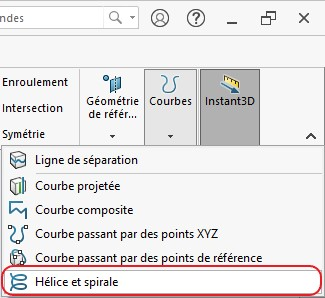

Y a deux paramètres très importants à spécifié à la fonction : 

1. La définition de l'hélice; 
2. Pas contant;
3. dans mon cas je veux une hauteur de 95mm  et un pas de 4 mm;
4. J'ai inversé la direction; 
5. Angle de départ de 300°

