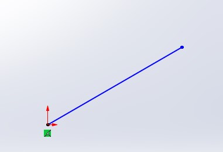

$$Version 1.0$$

Dans cette deuxième partie on s'intéressera à l'outil de base de la conception paramétrique sur SolidWorks qui est l'esquisse. 

$$version 1.1 
Il faut introduire la cotation intelligente.$$

$$version 1.2 
révision de l'orthographe et la saisie complète.$$

# Sommaire

## 1. Introduction à l'esquisse

Une esquisse sur SolidWorks est l'objet de base pour toutes conceptions, il représentera la géométrie ainsi que ses dimensions pour nos future pièces. On pourra dire aussi que l'esquisse est simplement un calque dans lequel on dessine des géométries de bases, vous pouvez rapidement comprendre qu'on pourra avoir autant de calques qu'on voudra, l'un superposé sur l'autre.
On pourra le comparer aussi aux dessins de définitions dans les plans.
Pour qu'un technicien ou un ingénieur conçoit une pièce il lui faut un dessin, les formes, les dimensions ainsi que les paramètres de ces formes (relations géométriques).

## 2. Créer, éditer et valider une esquisse

Passons au choses sérieuses maintenant, pour créer une nouvelle esquisse, au niveau du Bandeau principal, on clique sur l'onglet **"Esquisse"**, puis sur le bouton **"Esquisse"** ( figure suivante).

Il faudra ensuite spécifier un plan dans lequel on réalisera notre esquisse, SolidWorks vous proposera automatiquement le plan de face.

Vous pouvez faire pivoter les plans avec en appuyant sur le bouton de la molète de vote souris et de faire glisser votre souri, vous aurez ce nouveau visuel des trois plans de bases.

Dans le cas où vous sélectionnez l'un des trois plans, dans mon cas j'ai choisit le plan de face, l'esquisse sera crée, en suite il sera en mode édition.
La figure suivante résume tous les paramètres de notre esquisse.

1. Création de l'esquisse sur l'arbre de conception, SolidWorks le nomme automatiquement;
2. Les outils géométriques de base qui nous servirons à schématiser nos pièces;
3. Mode édition de l'esquisse pour valider ou annuler;
4. Point de référence avec lequel on pourra commencer la création de notre première forme géométrique.
   Il est souvent recommandé d'utiliser l'arbre de conception pour désigner un plan au moment de la création d'une nouvelle esquisse comme nous le montre la figure suivante.

## 2.1 Outils de bases

Dans cette partie nous explorons tous les outils de créations d'esquisse qui nous servira pour nos différentes pièces.

### a. L'outil ligne, unité, et propriétés d'une image

Commençons par l'outil ligne, cliquez sur le point de référence de notre plan pour créer le premier point de notre ligne . 

Faites glisser le curseur vers un deuxième point de votre choix, vous aurez une première ligne, vous pourriez continuer la construction de plusieurs lignes et si vous voulez quitter l'outil vous cliquez seulement sur le bouton **"ESC"** de votre clavier. Il existe un raccourci clavier qui est la touche **"l"** de votre clavier pour ne pas s'en servir beaucoup avec la souris. 

Remarque : Je vous recommande de toujours commencer la création de votre premier esquisse pen vous serant du  point de référence (figure ci-dessus ).

Il existe une deuxième ligne qu'on appelle __ligne de construction_, elle ne contribue pas au dessin mais elle nous sert pour paramétrer nos esquisse (créer des contraintes).

Suivez seulement les mêmes étapes qu'une création d'une ligne.

### b. Outil de cotation intelligentes

Après seulement l'utilisation des deux premiers outils de dessin, il faut que je  vous introduit la __cotation intelligente_, car en ingénierie tout a une mesure, les longueurs, les rayons, les distances entres les formes, les positions, l'inclinaison des formes, etc.
Pour cela il faut cliquer sur le bouton **"Cotation intelligente"**, il vous suffit ensuite de cliquer sur la forme désirer (l'entité ou la forme), dans notre cas une  ligne, est de faire glisser la souris vers un autre endroit du plan.
Vous pouvez constater lors de cette manipulation, l'orientation de notre cotation change avec le changement de l'orientation de votre souris, vous avez donc trois type de cotation : 

- cotation inclinée; 
- cotation verticale; 
- cotation horizontale.
  Un exemple d'une cotation inclinée sur la figure suivante.
  

Dans le cas où vous voulez verrouiller le pointeur pour n'avoir qu'une seule direction de cotation, il vous suffit de cliquer sur le bouton droit de votre souris. Voila un exemple dans lequel j'ai verrouillé le pointeur suivant la direction horizontale.

Continuons, si vous cliquer sur le bouton gauche de votre souris après avoir choisi l'orientation de votre première côte ainsi que sa position (le mieux est le milieu), vous aurez une boite de dialogue qui vous sert à introduire la valeur de votre côte, dans mon cas la valeur est de 80mm.

_Remarque_ : il est possible de changer la position la position de la côte même après validation de la saisie mais toujours dans l'état édition d'esquisse, il faut seulement le sélectionner.

Vous pouvez constaté que sur la barre d'état de SolidWorks, il est écrit **"Sous-contrainte"**, cela veut dire que notre esquisse n'est pas totalement bien définit, le point de départ de notre ligne est en coïncidence avec le point de référence, on ne peut pas le faire bouger, mais le deuxième point si, il est possible de la faire bouger. 

_Remarque_ : l'esquisse sous-contrainte est toujours en couleur bleu.

Pour le contraindre, il nous faut soit :

- rajouter une autre cotation sur une autre direction; 
- soit définir l'orientation de notre ligne.
  Je vais choisir la deuxième option, pour cela je vais me servir d'une ligne de construction qui sera horizontale, est définir un angle d'orientation de notre ligne par rapport à celle-ci avec l'outil de cotation intelligente.

L'esquisse prendra la couleur noire.

Remarque : une bonne conception est celle qui contraint totalement nos esquisses.

### c. Outil rectangle

Nous allons voir seulement les deux premiers types de construction d'un rectangle. Pour le rectangle passant par deux sommets, il suffit de cliquer sur le premier bouton **"Rectangle par sommet "**.

ça va vous demander de définir le premier sommet, vous faites glisser la souris pour définir sa longueur et sa largeur.

La deuxième option est de définir un rectangle par son centre qu'il faudra choisir en premier lieu après on passera à sa longueur et largeur.

### d. Outil cercle et arcs

Commençons par le cercle, il suffit de cliquer sur le bouton **"Cercle"** passant par son centre. 

Le premier point que vous allez créer est le centre du cercle et le deuxième est son rayon , faites glisser votre souris pour définir le rayon de votre cercle comme sur la figure suivante.

La  deuxième option pour les cercles est le cercle passant par trois points, de la même manière que nous avions suivi pour construire le premier cercle.

Passons maintenant à l'outil arc, de la même manière que nous avions procédé pour la création des cercles. Il existe trois options pour la création des arcs : 

- Arc par son centre ; 
- Arc tangent; 
- Arc par 3 points.
  Nous ne verrons que la première option, car les deux autres se fait de la même manière. Cliquez sur le bouton **" Arc par son centre"**.

Avec le clic gauche de votre souris sur un point de votre choix sur votre plan vous introduisez le centre de notre arc, ensuite on passera au diamètre en faisant glisser la souris jusqu'au deuxième clic gauche de votre souris, faite toujours glisser votre souris sur l'une des directions pour pouvoir tracer notre arc.

### e. Outil de rainure

Un outil très utile qui facilite vraiment la vie à l'utilisateur, au lieu de le faire à partir de zéro en utilisant les lignes et les arcs, l'outil **"rainure"** vous facolite la tâche. Il existe quatre façons de construire les rainures sur SolidWorks : 

- Rainure droite; 
- Rainure droite par son centre; 
- Rainure coure par 3 points; 
- Rainure courbe par son centre.
  Nous allons utilisé seulement la première, pour cela il faudrait cliquer sur le bouton "Rainure droite".

Il se construit en définition par le choix des positions de ses deux points distant d'une longueur , on passe après au diamètre de l'un de ses deux arcs.

La deuxième option est la rainure droite qu'on pourra définir par son centre et un second paramètre qui est la longueur entre ce centre et le centre de l'un de ses deux arcs.

### f. Outils des polygones

On créera un polygone avec cet outil. Cliquez sur le bouton **"Polygone"**.

Vous pouvez voir qu'il y a un paramètre du nombre de sommets du polygone, la valeur par défaut est 6 (hexagone) comme dans mon exemple.
Toujours on positionne son centre, ensuite on passe à la définition de sa longueur entre son centre et l'un des sommets du polygone.

_Remarque_ : le nombre minimal de sommets d'un polygone sur SolidWorks est 3, on aura ainsi un triangle équilatéral.

## 2.2 Outils avancés 1

Dans cette deuxième partie on verra des outils avancés de formes, nous allons voir les ellipses, les courbes de Bézier, le congé et le chanfrein.

### a. Outil d'ellipse

L'ellipse est une forme peu utilisé sur les dessins d'ingénierie, mais il faut apprendre comme même à s'en servir pour des besoins dans le cas de certaines pièces aux TPs.
Pour cela il faut cliquer sur le bouton **"Ellipse"**.

Premièrement il faut cliquer sur un point quiconque afin de créer le premier point qui est le centre de notre ellipse, je suppose que maintenant vous vous êtes habitué à penser au point de référence de SolidWorks, puis faites glisser la souris pour définir le premier diamètre suivant l'axe x.

Toujours en faisant glisser le souris vers une  direction perpendiculaire pour le second diamètre. La figure suivante nous montre le deuxième diamètre suivant l'axe y.

### b. Outil de courbes de Bézier (bspline)

Il s'agit simplement d'un outil qui crée une courbe passant par plusieurs point.

Vous pouvez modifier cette courbe en repositionnant les points qui la constitue, dans le cas où vous avez cliqué sur l'un de ces points qu'on appelle généralement les points de contrôles et vous le faites bouger, la courbe change automatiquement de forme.

### c. Outil congé, chanfrein

Nous commençons par utiliser le congé, c'est simplement de créer un arc tangent entre deux lignes, on arrondi l'intersection orthogonale. Cliquez sur le bouton de la fonction **"Congé d'esquisse"**.

Maintenant il faut spécifier les points, ou bien les deux lignes, il faut introduire le diamètre de l'arc tangent qui sera crée. Vous pouvez voir en couleur jaune les arcs.

De la même manière on peut choisir de créer un chanfrein au lieu du congé. Il faudrait cliquer sur le bouton de la fonction **"Chanfrein d'esquisse"**.

$$version 1.1 (il faut le revoir)$$

### d. Outil plan 3D

$$version 1.0$$

## 2.3 Outils avancés 2

On avait parlé jusqu'à maintenant des formes et leurs paramètres de création, dans cette section on s'intéresse aussi à des outils qui nous permettent de modifier les formes de bases déjà utiliser.

### a. Outil d'ajustement des entités

ça ressemble à un ciseau, il coupe les entités, l'outil d'ajustement est très utile lorsqu'il est question d'enlever certaines entités (formes). Pour cela nous cliquons sur le bouton de la fonction **"Ajuster les entités"**.

Vous pouvez voir dans cet exemple en appuyant sur la première option **"Ajustement intelligent"**, deux lignes sécantes et on veut garder que la partie basse. En gardant le clic du bouton gauche de la souris tout en survolant(trait gris) les deux entités d'en haut, SolidWorks va les ajusté.  

_Remarque_ : un petit carré rouge apparait au moment de l'intersection entre l'entité (ligne) et notre outil d'ajustement.

### b. Outil de conversion des entités

Nous parlerons plus de cet outil dans la partie conception volumique.

### c. Outil de décalage des entités

Cet outil permet de créer un contour à l'intérieur ou à l'extérieur ou les deux à partir d'une esquisse de base.
Il suffit de cliquer sur le  bouton **"Décaler les entités "**.

Vous pouvez le constater, un nouveau contour de couleur jaune entoure notre esquisse de base, sur le menu de gauche vous pouvez changer la valeur de la distance de décalage, préciser la direction ou mettre dans les deux directions (intérieure et extérieure).

### d. Outil de symétrie

Cet outil a besoin d'une ligne de construction qui nus servira d'axe de symétrie, pour utiliser cet outil cliquez sur le bouton de la fonction **"Symétrie des entités"**.  

Dans mon exemple, figure ci-dessous j'ai sélectionné :

1. Deux entités à symétrisées, un cercle et un triangle;
2. Axe de symétrie qui est la ligne de construction.

### e. Outil de répétition

Il existe deux formes de répétitions : 

- Linéaire;
- Circulaire.
  Nous commençons tout d'abord par voir la répétition linéaire. Avant de cliquez sur le bouton de la fonction **"Répétition linéaire d'esquisse"**cette fois-ci il faudra sélectionner l'entité qu'on veut symétriser.

Ensuite nous aurons la boite des propriétés sur la gauche comme la figure ci-dessous.  

On précise les axes suivants lesquels on veut crée nos répétitions : 

1. Répétition suivant l'axe x.
2. Répétition suivant y

Vous pouvez aussi modifier le nombre d'entité voulu ainsi que la distance entre elles.

Passons maintenant au deuxième outil, une fois l'entité est sélectionnée, dans le cas de mon exemple, un cercle, il faut ensuite cliquer sur le bouton de la fonction **"Répétition circulaire d'esquisse"**. 

la boite des propriétés s'ouvre sur la gauche, cette fois-ci on va choisir un point autour duquel notre entité va se répétée, vous pouvez aussi choisir le sens de rotation horaire ou anti-horaire.

### f. Outil de déplacement des entité

Cet outil nous sert à déplacer (translater) des entités, cliquez sur le bouton de la fonction **"Déplacer les entités"**.

Il faudra premièrement spécifier les entités, y une façon rapide de sélectionner toute l'esquisse, c'est de ce placer au milieu de l'esquisse, sa couleur deviendra alors orange.

Ensuite il faut paramétrer l'orientation et la distance, dans mon cas j'ai préféré de le faire par des distances par rapport aux axes.

Remarque_ : de la même façon que nous avions utilisé l'outil de déplacement, vous pourrez le répéter pour les fonctionnalités : 

- Copier des entités; 
- Pivoter des entités ( en spécifiant l'angler et la direction de l'angle );

Pour l'outil mettre à l'échelle les entités, en plus des entités à mettre en échelle, bien sur après avoir cliquer sur le bouton de la fonction **"Mettre à l'échelle les entités"**, il faudra spécifier un point à partir duquel SolidWorks va le construire, comme la figure suivante.

## 2.4 Outils d'orientations

Le changement d'orientation est en gros est de  passer d'une vue à une autre, ils sont des outils  très utilisés dans SolidWorks par l'utilisateur. 

1. Vue isométrique; 
2. Différentes vues (face, derrière, gauche, etc).

Vous pouvez le deviné, quand on sélectionne un plan quiconque, Par exemple, le plan de droite comme la figure ci-dessous, une petite boite de dialogue apparait.

 Si vous cliquez sur le dernier bouton sur la droite, le bouton **"normal"**, il va s'orienter suivant la normale du plan (ou face ) choisi. Il existe un raccourci clavier qui est le bouton **"espace"** pour faire apparaitre le menu des vues.

