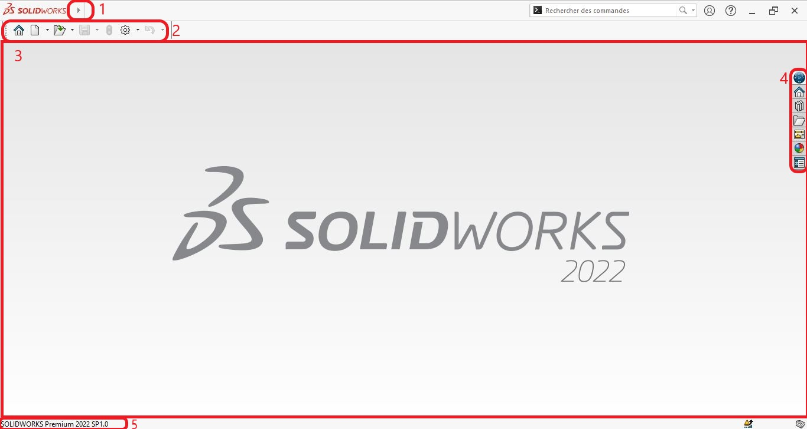
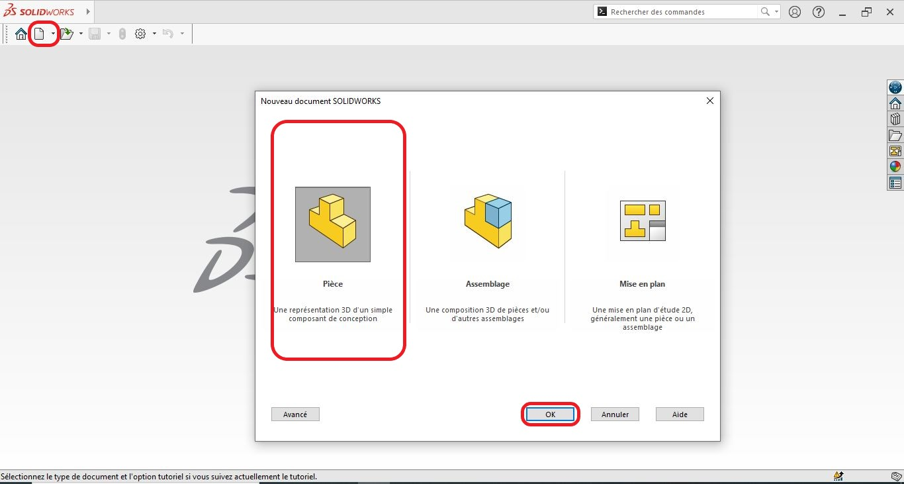
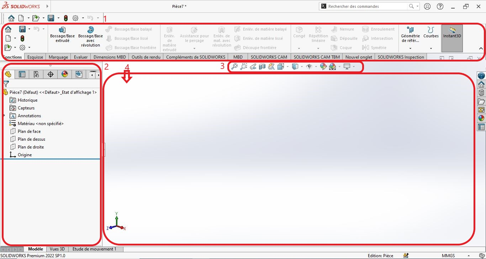
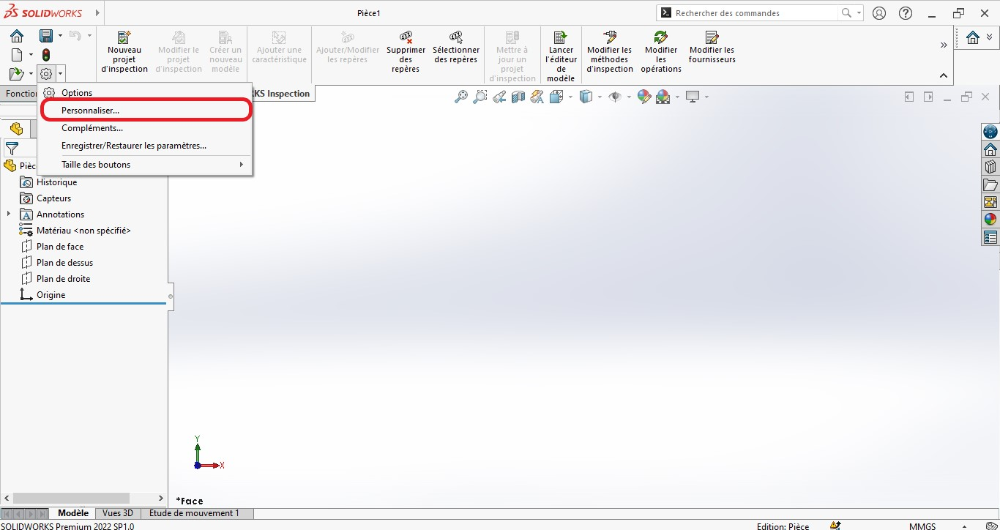
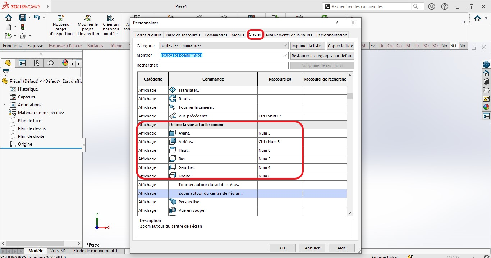
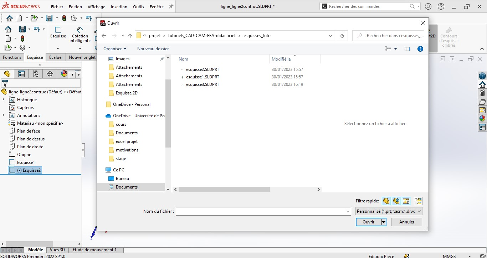

$$version 1.0$$

Première partie du premier chapitre qui est une brève présentation de SolidWorks, son interface graphique et comment le configurer pour une meilleur utilisation.

# Sommaire

## 1. Présentation

SolidWorks est un logiciel de la CAO (Conception Assisté par Ordinateur), il est de type paramétrique, il est possible de créer des entités géométriques (ligne, cercle, ellipse, arc...etc) avec des paramètres géométrique (diamètre, longueur, angle, ) qu'on pourra facilement modifier à n'importe quel moment de la conception. Il en y existe d'autre qui diffère de la manière dont on conçoit nos pièces, mais SolidWorks nous permet une flexibilité qui nous facilite la création de nos pièces.

Il est beaucoup utilisé par des techniciens et ingénieurs, dans différentes branches, mécanique, électrique, mécatronique, électrotechnique, etc, et différents domaines, automobile, ferroviaire, spatiale, énergétique, etc.

Le logiciel est conçu en 1993 par [Jon Hirschtick](https://en.wikipedia.org/wiki/Jon_Hirschtick) à MIT, il présente sa première version 1995, racheté en 1997 par Dassault Systems. II existe des version gratuite   sur ce lien  [Essais de produits en ligne | SOLIDWORKS](https://www.solidworks.com/fr/online-product-trials)   , et  pour la pédagogie que vous pouvez télécharger sur ce lien  [SOLIDWORKS pour les étudiants | SOLIDWORKS](https://www.solidworks.com/fr/product/students) .    

## 2. Interface

En double cliquant sur l'icone de SolidWorks sur votre bureau, bien sur après l'avoir installé, vous aurez la fenêtre principale de SolidWorks comme cette figure :

Ne vous inquiétez pas si vous n'avez pas exactement cette interface, on reviendra sur ça, le plus important est de vous présenter chaque éléments de cette interface.

1. barre du menu principal de SolidWorks;
2. barre d'outils ;
3. Fenêtre de travail;
4. volet des tâches ; 
5. barre d'état.

En cliquant sur le bouton nouveau de la barre d'outils de la première fenêtre du logiciel  vous allez tomber sur un menu permettant la création soit d'une nouvelle pièce, assemblage ou mise ne plan.

Dans notre cas on voit choisir la première option.

Cela nous ouvrira sur une nouvelle interface, c'est vrai que y a certains boutons qui sont toujours la base de la fenêtre principale de SolidWorks, mais on tombera sur cette figure.

1. Le bandeau principal des focntionnalités de base de SolidWorks le plus souvent utilisé.
2. L'Arbre de conception.
3. Diverses icônes : Vue en coupe, Zoom, Apparence, Vues, ...
4. L'espace principal du travail.

### 3. Préférences

Dans cette partie on fait l'objet de configuration de notre interface pour une meilleur ergonomie, une facilité d'utilisation et de productivité.

Tout d'abord nous allons nous intéresser seulement à la partie Personnalisation des racourcis clavier des vues.

En cliquant sur le bouton Personnaliser vous aurez cette fenêtre, il vous suffit seulement de choisir un racourcis clavier pour chaque vue, comme je l'avais défini moi.

Comme vous pouvez le constater il existe différentes vues pour lesquelles suivant la vue qu'il vous semble pratique de réaliser les fonctions de conception. Dans mon cas j'ai choisi Num5 pour la vue de face et Ctrl + Num5 pour la vue de derrière.

 version 1.4

## 4. Enregistrement des fichiers

Pour enregistrer un fichier de conception sur SolidWorks, on clique sur le menu "Fichier" puis sur le  bouton "Enregistrer", ou cliquez sur les raccourci clavier ctrl+s.

Une boite de dialogue s'ouvrira, le fichier de conception a l'extension .sldprt, il faudrait spécifier :

1. le nom du fichier;
2. le chemin.

## 5. Ouvrir un fichier de conception

Pour ouvrir un fichier déjà existant, on clique sur le menu "Fichier" puis sur le bouton "Ouvrir", puis choisir un chemin et sélectionner le fichier à ouvrir.
La différence ici, est que, tous les fichiers peuvent être ouverts (conception, assemblage et mis en plan).

