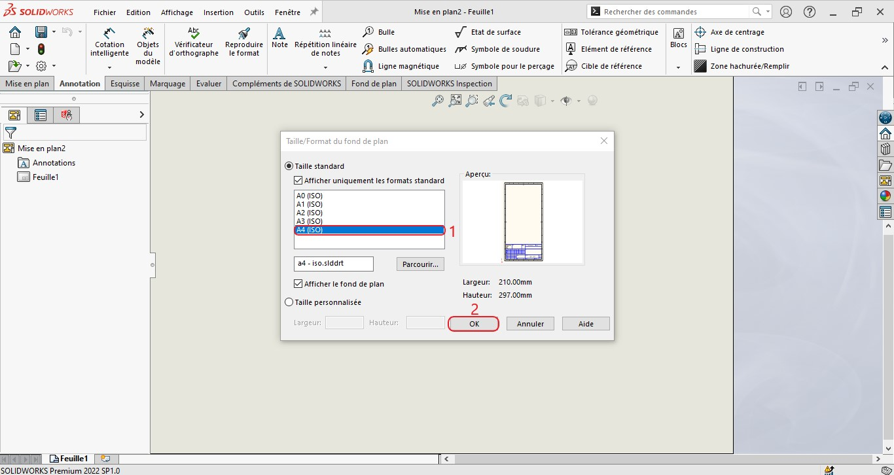
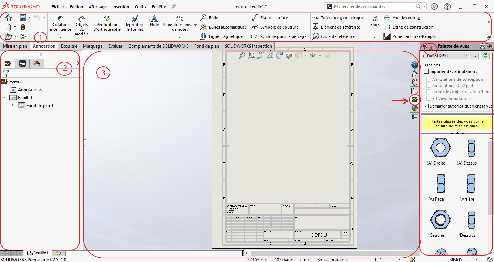
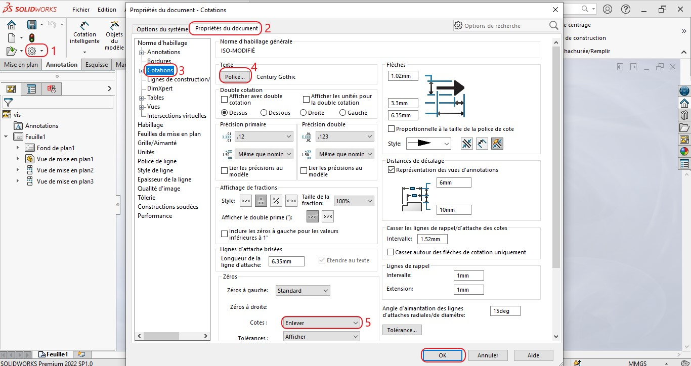
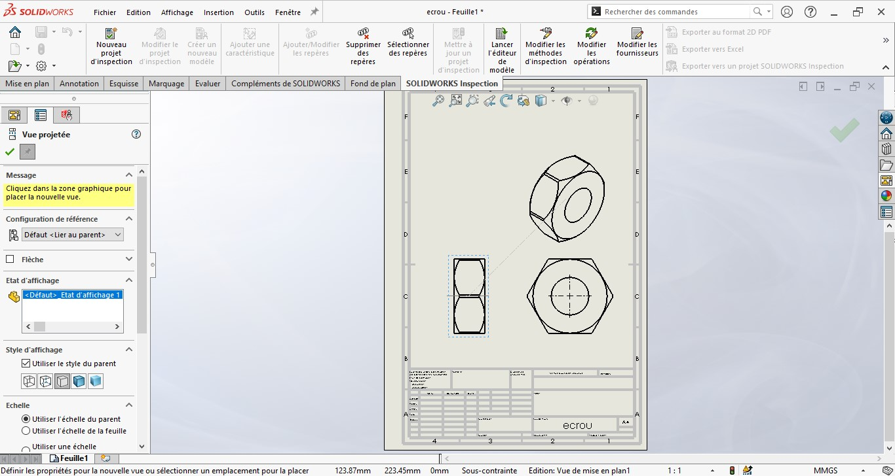
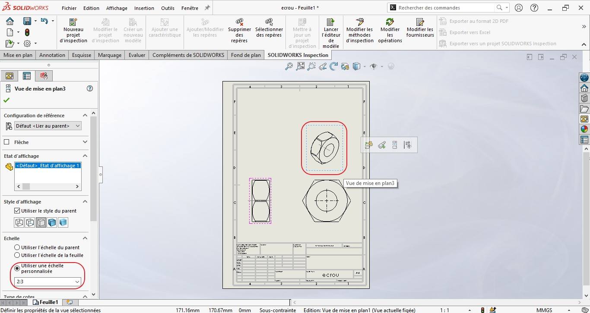
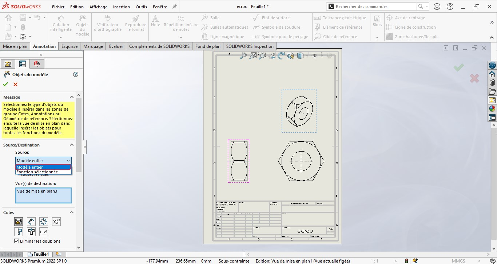
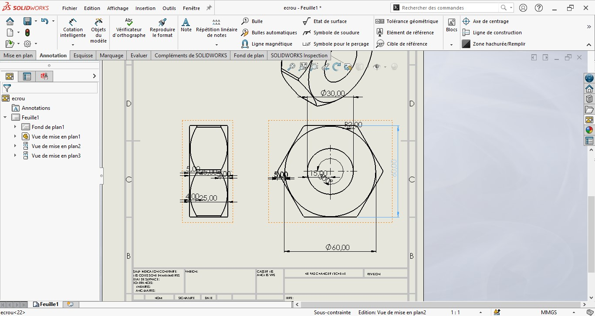
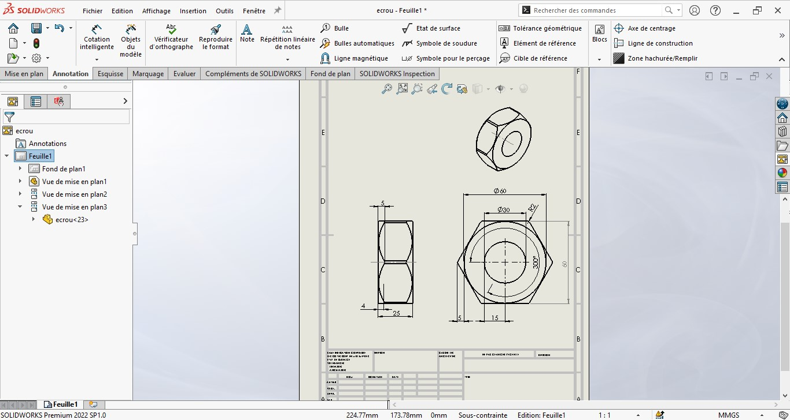
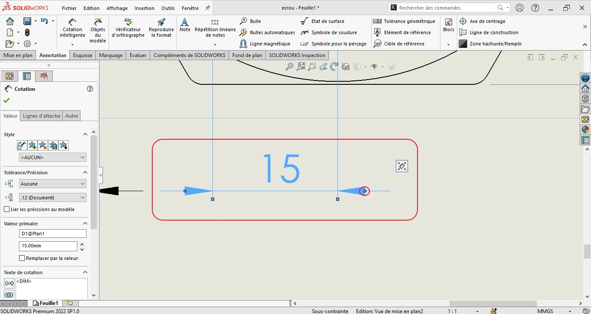
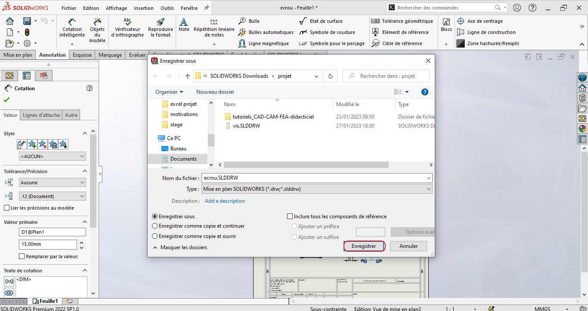

$$version 1.0$$

![[SolidWorks/Partie_mise-en-plan/about|about]]

Ce cours est basé sur une vidéo  YouTube qui parle sur les bases de la création d'une première mise en plan sur SolidWorks sur une pièce déjà existante.

[(11) TCH007: Introduction aux mises en plan - YouTube](https://www.youtube.com/watch?v=FelaJRabIws&t=108s)

version PDF de cette note : [[🗂️Partie mise en plan.pdf]]

## 1. Création de la première mise en plan

Sur le fichier de conception de notre pièce on clique sur le bouton "Créer une mise en plan à partir de la pièce" du menu Fichier.

Nous aurons comme résultat cette première fenêtre dédiée à la mise en plan de SolidWorks, Vous pouvez décocher l'option "Afficher uniquement les formats standards" pour voir tous les différents formats qui existent. J'ai choisi le format "iso A4" puis j'ai validé en cliquant sur le bouton "OK".

Vous avez devant vous la troisième interface de SolidWorks dédiée pour la mise en plan. Elle ressemble bien aux deux autres,
1.  Bandeau principal;
2.  Arbre de création, il contient toute la feuille du dessin ;
3.  Espace de travail;
4.  Arbre de vue, il seulement ouvert dans le cas d'un projet de mise en plan.

## 2. Personnalisation

Pour personnaliser la police, mettre la taille à 14, mais enlever aussi les zéros de droite sur nos côtes, il faut suivre la suite l'ordre des clique des boutons comme la figure ci-dessous.

## 3. Déposer des vues

Nous continuons notre long chemin, pour déposer les vues sur notre feuille, on va se servir de l'arbre des vues sur la droite, vous pouvez commencer par déposer la vue de face. Pour cela cliquez sur cette vue et faites-la glisser sur la feuille.

Maintenant dans le cas où vous allez sur la droite de votre écran, SolidWorks va vous générer automatiquement une nouvelle vue, celle de gauche, faites encore bouger votre curseur de souris vers le haut, il va vous générer la vue isométrique, après il faudra seulement valider.

Vous constatez que seule la vue de face qu'il est possible de faire bouger sur la fuille, , car elle est la vue parente de toutes les vues, à l'exception de la vue isométrique.

Si vous faites bouger la vue de face celle de gauche bougera à son tour.

Il est possible de changer d'échelle des vues, soit sur l'ensemble des vues, soit sur une seule vue. Je vais le faire dans mon cas sur seulement la vue isométrique.

Il faut sélectionner la vue désirée, sur la barre des propriétés, se mettre sur l'la partie "Echelle" et cocher l'option "Echelle personnalisé ", d'une valeur de 2:3.

$$version 1.1$$
Types d'affichage des vues (filaire, cotation cachées ) version 1.0

$$version 1.0$$

## 4. Création des côtations

Pour Commencer la cotation, le mieux est d'utiliser un outil très efficace de SolidWorks qui nous permet une première cotation simple et rapide, mais peu fiable, souvent il faut lui apporter des modifications.

Pour cela il faut se rendre sur l'onglet "Annotations " du bandeau principal, puis cliquer sur le bouton "Objets du modèle" comme cette figure.

Sur la barre des propriétés de la gauche de l'écran, mettre la valeur de source à "Modèle complet" et on valide.

L'aperçu se présente comme ceci :

Vous remarquez que les côtes sont males insérées sur les vues.

# 5. Editer les cotations

Maintenant on procède à l'édition de ces cotations que nous avions insérées dans le précédent titre.

Pour cela il vous suffit seulement de sélectionner une côte et maintenir le clic gauche de la souris et faire glisser votre curseur à l'endroit voulu.

Avec des simples clics avec ma souris j'ai réussi à modifier les côtes générer par SolidWorks.
Vous pouvez voir le résultat sur la figure suivante.

Si vous voulez inverser la direction des flèches qui nous sert pour la cotation, il fait le sélectionner, ensuite il faudra cliquer sur le petit cercle noir (entouré en rouge sur ma figure).

Vous pouvez aussi une nouvelle côte dans certains cas avec le bouton "Cotation intelligente", car SolidWorks ne crée pas automatiquement toutes les côtes de nos pièces.

## 6. Sauvegarder une mise en plan

Une fois votre feuille est terminée il faudra la sauvegarder, pour cela rien de plus simple, sur le menu Fichier cliquez sur le bouton "Enregistrer sous" ou à l'aide du raccourci clavier "ctrl +s".

Les fichiers de mise en plan sur SolidWorks ont l'extension .slddrw, donnez un nom au fichier et un chemin et cliquez à la fin sur le bouton "Enregistrer".

